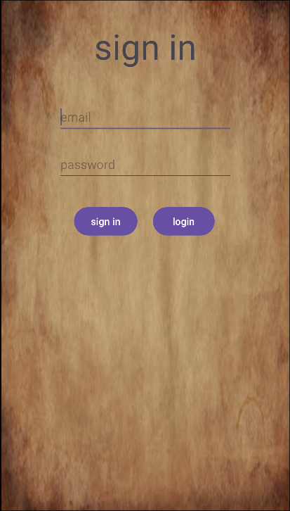
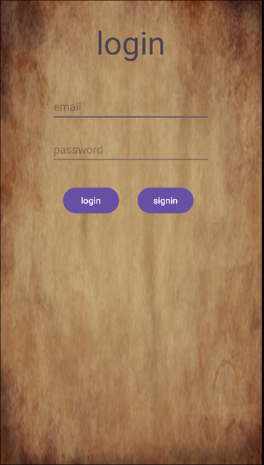
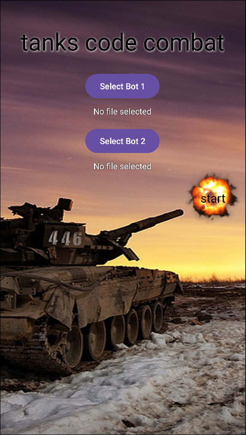
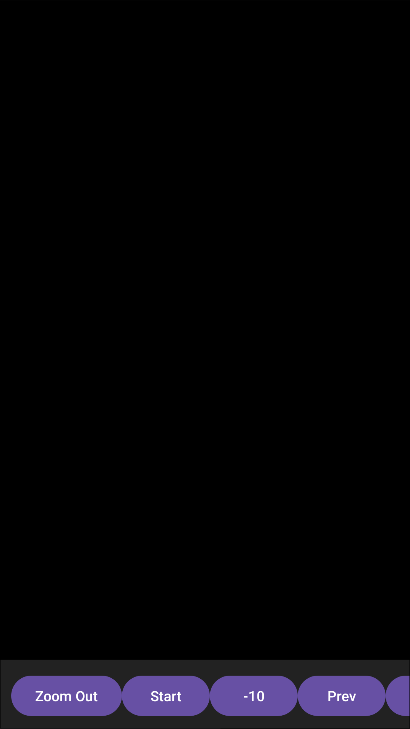
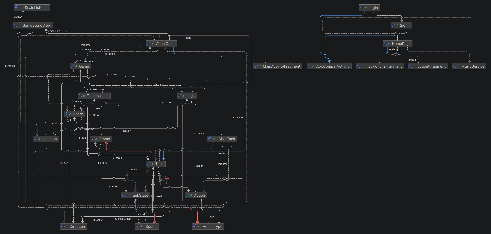
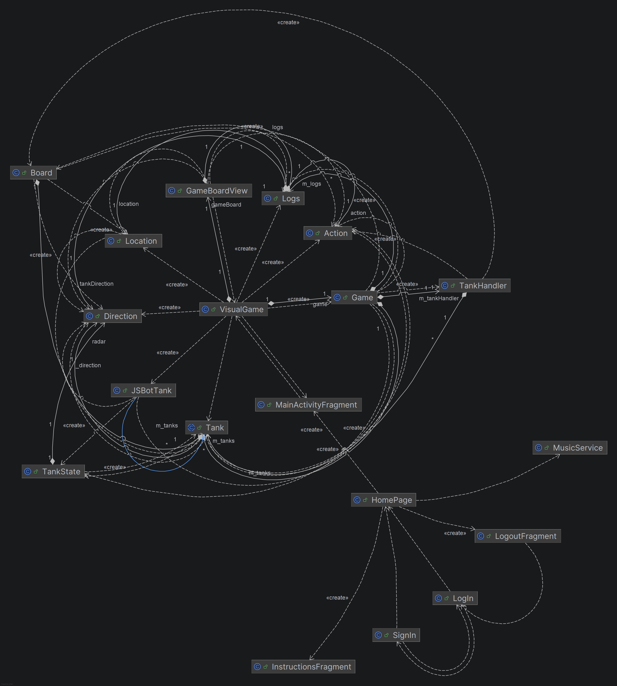
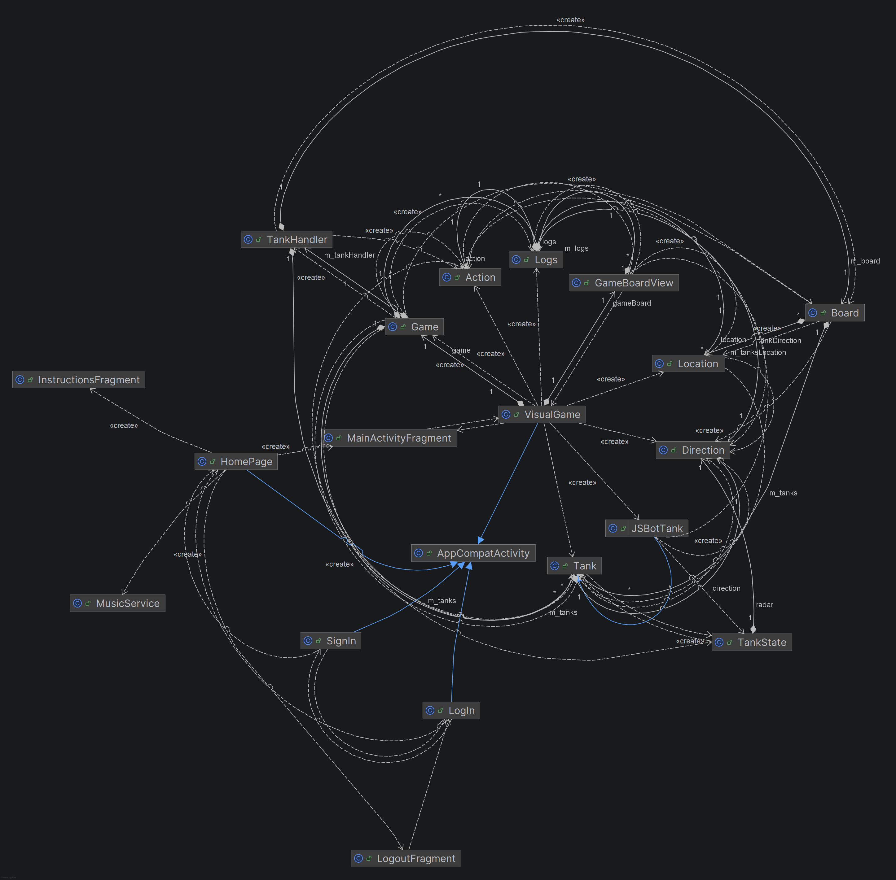
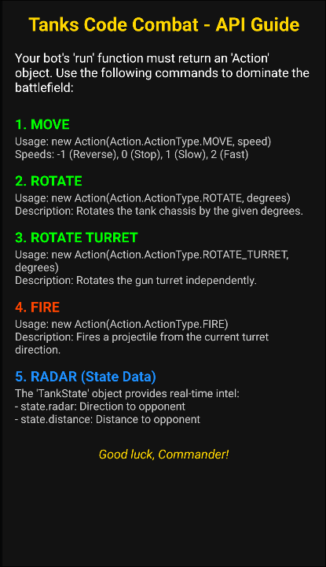

<div dir="rtl" style="text-align: right;">

# Tanks Code Combat

**מגיש:** אביב פרקש

**ת.ז.:** 312398449

**בית ספר:** העמק המערבי יפעת

**מנחה:** גבי לוינהיים

**חלופה:** פיתוח אפליקציות לטלפונים חכמים

**תאריך הגשה:** אפריל 2026

---

## תוכן עניינים
1. **[1. מבוא](#1-מבוא)**
    - [רקע](#רקע)
    - [שם הפרויקט](#שם-הפרויקט)
    - [תיאור הפרויקט](#תיאור-הפרויקט)
    - [קהל יעד](#קהל-יעד)
    - [סיבות לבחירת הנושא](#סיבות-לבחירת-הנושא)
    - [האפליקציה ומטרותיה](#האפליקציה-ומטרותיה)
2. **[2. מחקר](#2-מחקר)**
    - [אפליקציות דומות בשוק](#אפליקציות-דומות-בשוק)
    - [סקירת השוק](#סקירת-השוק)
3. **[3. ניהול הנתונים בפרויקט](#3-ניהול-הנתונים-בפרויקט)**
    - [אובייקטים נחוצים](#אובייקטים-נחוצים)
4. **[4. מבנה / ארכיטקטורה](#4-מבנה--ארכיטקטורה)**
    - [קבצי הפרויקט](#קבצי-הפרויקט)
    - [מסכי הפרויקט (LogIn, SignUp, HomePage, VisualGame)](#מסכי-הפרויקט)
    - [תרשים מסכים (Screen Flow)](#תרשים-מסכים)
5. **[5. מימוש הפרויקט](#5-מימוש-הפרויקט)**
    - [קבצי gradle ו-manifest](#מימוש-הפרויקט)
    - [תיאור מחלקות UML](#תיאור-מחלקות-uml)
6. **[6. בסיס נתונים](#6-בסיס-נתונים)**
    - [סקירה (Authentication & Realtime Database)](#בסיס-נתונים)
7. **[7. מחלקות הפרויקט](#7-מחלקות-הפרויקט)**
    - [Activities](#activities)
    - [Fragments](#fragments)
    - [Game Engine](#game-engine)
    - [Models / Utilities](#models-utilities)
    - [ממשק פנימי](#ממשק-פנימי)
8. **[8. מדריך למשתמש](#8-מדריך-למשתמש)**
    - [דרישות והוראות התקנה](#מדריך-למשתמש)
    - [הסבר מפורט על שימוש באפליקציה](#מדריך-למשתמש)
9. **[9. רפלקציה / סיכום אישי](#9-רפלקציה--סיכום-אישי)**
10. **[10. ביבליוגרפיה](#10-ביבליוגרפיה)**
11. **[11. נספחים](#11-נספחים)**

---

<a name="1-מבוא"></a>
## 1. מבוא

<a name="רקע"></a>
### רקע:
בעולם המודרני, פיתוח חשיבה אלגוריתמית ויכולת כתיבת קוד הופכים לכלים חיוניים. הפרויקט "Tanks Code Combat" שואף לשלב בין עולם המשחקים האינטראקטיביים לבין לימוד יסודות התכנות, תוך מתן פלטפורמה תחרותית ומהנה למשתמשים.

<a name="שם-הפרויקט"></a>
### שם הפרויקט:
**Tanks Code Combat**

<a name="תיאור-הפרויקט"></a>
### תיאור הפרויקט:
הפרויקט הוא משחק אסטרטגיה ותכנות דו-שחקני. בניגוד למשחקי טנקים מסורתיים בהם השליטה היא ידנית בזמן אמת, כאן המשתמש כותב "בוט" (Bot) – סקריפט המכתיב את התנהגות הטנק. המשחק כולל מערכת לניהול משתמשים, מסד נתונים לסנכרון מצב הקרב, וסימולטור ויזואלי המציג את תוצאות הקוד שנכתב. הקרב מתנהל בזירה דו-מימדית בה הטנקים צריכים לתמרן, לסרוק את השטח ולירות במטרה להשמיד את היריב.

<a name="קהל-יעד"></a>
### קהל יעד:
קהל היעד כולל תלמידים, סטודנטים וחובבי טכנולוגיה המעוניינים לתרגל פתרון בעיות, לוגיקה ותכנות בסביבה חזותית. המשחק מותאם למי שמחפש אתגר אינטלקטואלי מעבר למשחקי פעולה רגילים.

<a name="סיבות-לבחירת-הנושא"></a>
### סיבות לבחירת הנושא:
בחרתי בנושא זה בשל העניין האישי שלי בשילוב שבין לוגיקה מורכבת לייצוג ויזואלי בזמן אמת. האתגר הטכני של בניית מנוע משחק שיודע להריץ קוד של משתמש קצה (JavaScript) בתוך סביבת אנדרואיד היה המניע המרכזי לפיתוח. בנוסף, רציתי לחקור את השימוש ב-Firebase לסנכרון נתונים אסינכרוני במערכת מרובת משתתפים.

<a name="האפליקציה-ומטרותיה"></a>
### האפליקציה ומטרותיה:
האפליקציה נועדה לספק סביבה בטוחה ומהנה ללימוד תכנות. המטרות העיקריות הן:
1. הנגשת עולם התכנות דרך משחק.
2. יצירת זירה תחרותית המעודדת אופטימיזציה של קוד.
3. מתן ממשק מובייל נוח לכתיבה ובחינה של לוגיקה קרבית.

---

<a name="2-מחקר"></a>
## 2. מחקר

<a name="אפליקציות-דומות-בשוק"></a>
### אפליקציות דומות בשוק:
1. **Robocode:** מערכת ותיקה למחשב האישי שבה מתכנתים טנקים ב-Java. היא מהווה את ההשראה המרכזית, אך Tanks Code Combat מביא את הקונספט לעולם המובייל עם דגש על פשטות ונגישות.
2. **Screeps:** משחק MMO למתכנתים שבו השליטה במושבה מתבצעת דרך JavaScript. המשחק מאוד מורכב ויכול להרתיע מתחילים, בעוד שהפרויקט שלי מתמקד בקרבות קצרים ומהירים.
3. **Chess.com:** אמנם מדובר במשחק לוח מסורתי, אך הוא מדגים את החשיבות של ניהול משתמשים, דירוגים וסנכרון מצב משחק – אלמנטים שיושמו גם כאן.

<a name="סקירת-השוק"></a>
### סקירת השוק:
ממחקר השוק שערכתי, רוב האפליקציות המשלבות תכנות במובייל הן "קורסים" סטטיים. קיימות מעט מאוד אפליקציות המאפשרות תחרות אקטיבית מבוססת קוד בזמן אמת עם ממשק גרפי מלוטש. רוב המשחקים הקיימים הם Arcade ואינם דורשים חשיבה אסטרטגית מוקדמת. Tanks Code Combat תופס את הנישה שבין לימוד תיאורטי לבין משחק פעולה.

---

<a name="3-ניהול-הנתונים-בפרויקט"></a>
## 3. ניהול הנתונים בפרויקט

<a name="אובייקטים-נחוצים"></a>
### אובייקטים נחוצים:

**במשחק:**
- **Tank (טנק):** מייצג את הישות של השחקן. מכיל נתונים כמו מיקום (Location), כיוון (Direction), כמות חיים, סוג תחמושת ומהירות.
- **Board (לוח):** מנהל את המרחב הדו-מימדי, כולל מכשולים וזיהוי התנגשויות בין פגזים לטנקים.
- **Action (פעולה):** אובייקט המייצג הוראה בודדת שנוצרה על ידי הקוד (למשל: תזוזה קדימה, סיבוב צריח).
- **Logs (יומנים):** מתעד כל שלב בקרב לצורך הצגה חוזרת (Replay) בסימולטור הויזואלי.

**מחוץ למשחק:**
- **User (משתמש):** פרטי המשתמש נחלקים לשניים:
    1. **Authentication:** אימות (מייל וסיסמה) מנוהל ב-Firebase Auth.
    2. **Database Profile:** שם תצוגה, מספר נצחונות וסטטיסטיקות נשמרים ב-Realtime Database.

---

<a name="4-מבנה--ארכיטקטורה"></a>
## 4. מבנה / ארכיטקטורה

<a name="קבצי-הפרויקט"></a>
### קבצי הפרויקט:
הפרויקט בנוי במבנה Android תקני ומאורגן בחבילות (Packages) להפרדת אחריות:
- `com.example.tankscodecombat`: החבילה הראשית.
- `Activities`: `LogIn.java`, `SignIn.java`, `HomePage.java`, `VisualGame.java`.
- `Fragments`: `MainActivityFragment.java`, `InstructionsFragment.java`, `LogoutFragment.java`.
- `Game Engine`: `Game.java`, `Board.java`, `TankHandler.java`, `JSBotTank.java`.
- `Models`: `Tank.java`, `Action.java`, `TankState.java`, `Location.java`, `Direction.java`.
- `res/layout/`: קבצי ה-XML המגדירים את נראות המסכים.

<a name="מסכי-הפרויקט"></a>
### מסכי הפרויקט:

**שם המסך: LogIn (מסך כניסה)**
- **תיאור:** דף הכניסה למשתמשים קיימים.
- **אלמנטים:** תיבות טקסט למייל וסיסמה, כפתור כניסה וקישור להרשמה.
  

**שם המסך: SignUp (מסך הרשמה)**
- **תיאור:** דף ליצירת חשבון חדש.
- **אלמנטים:** שם משתמש, מייל, סיסמה וכפתור אישור השומר את הנתונים ב-Firebase.
  

**שם המסך: HomePage (מסך הבית)**
- **תיאור:** מרכז הניווט של האפליקציה.
- **אלמנטים:** תפריט תחתון (Bottom Navigation) למעבר בין מסך הבית, הוראות וניתוק.
  

**שם המסך: MainActivityFragment (טעינת בוטים)**
- **תיאור:** המסך המאפשר בחירת בוטים ממערכת הקבצים או מה-Database.
- **אלמנטים:** כפתורי "Select Bot", כפתור "Start Game".
  

**שם המסך: VisualGame (זירת הקרב)**
- **תיאור:** הזירה הויזואלית שבה מתבצעת הסימולציה.
- **אלמנטים:** `GameBoardView` (תצוגת הלוח), כפתורי שליטה בסימולציה (Play, Pause, Forward).
  

<a name="תרשים-מסכים"></a>
### תרשים מסכים (Screen Flow):
הניווט באפליקציה מתבצע בצורה הבאה:
- **LogIn Activity**: נקודת הכניסה. ניתן לעבור ל-SignIn או להתחבר.
- **SignIn Activity**: יצירת חשבון וחזרה ל-LogIn או מעבר ל-HomePage.
- **HomePage Activity**: מסך הבית עם Bottom Navigation:
    - **Home (MainActivityFragment)**: בחירת בוטים ומעבר ל-VisualGame.
    - **Instructions (InstructionsFragment)**: קריאת התיעוד.
    - **Logout (LogoutFragment)**: התנתקות וחזרה ל-LogIn.
- **VisualGame Activity**: הרצת הקרב והצגת התוצאות.

---

<a name="5-מימוש-הפרויקט"></a>
## 5. מימוש הפרויקט

<a name="מימוש-הפרויקט"></a>
### קבצי gradle ו-manifest:

**gradle (Module: app):**
```gradle
dependencies {
    implementation 'com.google.firebase:firebase-auth:22.3.1'
    implementation 'com.google.firebase:firebase-database:20.3.1'
    implementation 'androidx.appcompat:appcompat:1.6.1'
    implementation 'com.google.android.material:material:1.11.0'
    implementation 'androidx.constraintlayout:constraintlayout:2.1.4'
    implementation 'org.mozilla:rhino:1.7.14'
}
```

**AndroidManifest.xml:**
```xml
<manifest xmlns:android="http://schemas.android.com/apk/res/android">
    <application
        android:icon="@mipmap/ic_launcher"
        android:label="@string/app_name"
        android:theme="@style/Theme.TanksCodeCombat">
        <activity android:name=".MainActivity" android:exported="true">
            <intent-filter>
                <action android:name="android.intent.action.MAIN" />
                <category android:name="android.intent.category.LAUNCHER" />
            </intent-filter>
        </activity>
        <activity android:name=".HomePage" />
        <activity android:name=".VisualGame" />
        <activity android:name=".LogIn" />
        <activity android:name=".SignIn" />
        <service android:name=".MusicService" />
    </application>
</manifest>
```

<a name="תיאור-מחלקות-uml"></a>
### תיאור מחלקות UML:

**מבנה היררכי:**


**מבנה רדיאלי (קשרי גומלין):**


**קשרים עם AppCompatActivity:**


---

<a name="6-בסיס-נתונים"></a>
## 6. בסיס נתונים

<a name="בסיס-נתונים"></a>
### סקירה:
הפרויקט עושה שימוש ב-**Firebase**, שירות ענן של גוגל.
- **Authentication:** ניהול רישום וכניסה מאובטחת. כל משתמש מקבל UID ייחודי.
- **Realtime Database:** בסיס נתונים NoSQL בתצורת עץ JSON.
    - ענף `users/`: שומר תחת כל UID את השם (`name`), מספר הנצחונות (`wins`) וכמות המשחקים (`games_played`).
    - ענף `bots/`: שומר את קוד ה-JavaScript האחרון שכתב המשתמש.

---

<a name="7-מחלקות-הפרויקט"></a>
## 7. מחלקות הפרויקט

<a name="activities"></a>
### Activities (אקטיביטיז)

#### LogIn.java
**תפקיד המחלקה:**
מחלקה זו אחראית על מסך הכניסה של האפליקציה. היא מאפשרת למשתמשים קיימים להתחבר באמצעות אימייל וסיסמה דרך Firebase Authentication וניהול כניסה אוטומטית בעזרת SharedPreferences.

**תכונות המחלקה:**
- `ETemail`: EditText להזנת אימייל המשתמש.
- `ETpassword`: EditText להזנת סיסמת המשתמש.
- `ref`: אובייקט FirebaseAuth לניהול האימות מול השרת.
- `prefs`: SharedPreferences לשמירת נתוני חיבור מקומיים לצורך כניסה מהירה בעתיד.

**פעולות המחלקה:**

**שם:** `onCreate`
**תוכן:**
```java
@Override
protected void onCreate(Bundle savedInstanceState) {
    super.onCreate(savedInstanceState);
    setContentView(R.layout.activity_log_in);
    ETemail = findViewById(R.id.email);
    ETpassword = findViewById(R.id.password);
    ref = FirebaseAuth.getInstance();
    prefs = getSharedPreferences("LoginPrefs", MODE_PRIVATE);
    // Auto-login logic: check if user is already signed in via ref or prefs
}
```
**תיאור:** מאתחלת את רכיבי הממשק, מקשרת אותם למשתני המחלקה ובודקת אם המשתמש כבר מחובר לצורך כניסה אוטומטית.

**שם:** `Login`
**תוכן:**
```java
public void Login(View view) {
    String email = ETemail.getText().toString();
    String password = ETpassword.getText().toString();
    if (email.isEmpty() || password.isEmpty()) return;
    ref.signInWithEmailAndPassword(email, password)
       .addOnCompleteListener(this, task -> {
           if (task.isSuccessful()) {
               startActivity(new Intent(this, HomePage.class));
               finish();
           }
       });
}
```
**תיאור:** פונקציה המופעלת בלחיצה על כפתור ה-Login. היא מושכת את הטקסט מהשדות ומנסה לבצע אימות מול Firebase. במקרה של הצלחה, המשתמש מועבר למסך הבית.

**שם:** `goToSignIn`
**תיאור:** מעבירה את המשתמש למסך ההרשמה (`SignIn.java`).

---

#### SignIn.java
**תפקיד המחלקה:**
ניהול מסך ההרשמה ליצירת משתמשים חדשים במערכת.

**תכונות המחלקה:**
- `ETemail`: EditText להזנת אימייל חדש.
- `ETpassword`: EditText להזנת סיסמה חדשה.
- `ref`: אובייקט FirebaseAuth ליצירת המשתמש בשרת.

**פעולות המחלקה:**

**שם:** `createUser`
**תוכן:**
```java
public void createUser(View view) {
    String email = ETemail.getText().toString();
    String password = ETpassword.getText().toString();
    ref.createUserWithEmailAndPassword(email, password)
       .addOnCompleteListener(this, task -> {
           if (task.isSuccessful()) {
               startActivity(new Intent(this, HomePage.class));
               finish();
           }
       });
}
```
**תיאור:** יוצרת משתמש חדש ב-Firebase Authentication ומעבירה אותו למסך הבית.

---

#### HomePage.java
**תפקיד המחלקה:**
ניהול התפריט הראשי והמעבר בין הפרגמנטים השונים (בית, הוראות, התנתקות) באמצעות Bottom Navigation.

**פעולות:**

**שם:** `onCreate`
**תיאור:** מגדירה את המאזין ל-BottomNavigationView וטוענת את הפרגמנט ההתחלתי (`MainActivityFragment`).

**שם:** `loadFragment`
**תוכן:**
```java
private void loadFragment(Fragment fragment) {
    getSupportFragmentManager()
            .beginTransaction()
            .replace(R.id.fragmentContainer, fragment)
            .commit();
}
```
**תיאור:** פונקציית עזר המחליפה את הפרגמנט המוצג בתוך ה-Container הראשי של המסך.

---

#### VisualGame.java
**תפקיד המחלקה:**
המסך המרכזי שבו מוצגת סימולציית הקרב בין הבוטים. אחראי על הרצת הלוגיקה והצגת התוצאות בצורה ויזואלית.

**תכונות המחלקה:**
- `game`: אובייקט ה-Game המנהל את לוגיקת הקרב הנסתרת.
- `gameBoard`: Custom View (GameBoardView) לציור שדה הקרב.
- `replayLogs`: רשימה של אובייקטי Logs המכילים את כל מהלכי המשחק לצורך הצגתם.

**פעולות המחלקה:**

**שם:** `saveGame`
**תיאור:** פונקציה פרטית השומרת את תוצאות המשחק ויומני המהלכים ב-Firebase Realtime Database תחת תיקיית המשתמש המחובר.

**שם:** `showGameResult`
**תיאור:** מציגה דיאלוג למשתמש בסיום הקרב המודיע מי המנצח (או אם היה תיקו).

---

<a name="fragments"></a>
### Fragments (פרגמנטים)

#### MainActivityFragment.java
**תפקיד המחלקה:**
מנהל את התוכן המרכזי של דף הבית – בחירת בוטים והרצת משחקים.

**פעולות:**

**שם:** `loadBot1 / loadBot2`
**תיאור:** מפעיל את ה-ActivityResultLauncher לבחירת קובץ JavaScript ממערכת הקבצים של המכשיר.

**שם:** `startGame`
**תיאור:** אוסף את קוד הבוטים שנבחרו ועובר לאקטיביטי `VisualGame` להרצת הסימולציה.

**שם:** `loadBotFromDB`
**תיאור:** מושכת רשימת בוטים שנשמרו בעבר מה-Database של המשתמש ומאפשרת לבחור אותם לקרב.

---

#### InstructionsFragment.java
**תפקיד המחלקה:**
מציג למשתמש את ה-API וההוראות לכתיבת הבוט (JavaScript API).

---

#### LogoutFragment.java
**תפקיד המחלקה:**
ביצוע ניתוק מהחשבון (`signOut`) וחזרה למסך הכניסה.

---

<a name="game-engine"></a>
### Game Engine (מנוע המשחק)

#### Game.java
**תפקיד המחלקה:**
המנוע המרכזי המריץ את לוגיקת הקרב בתורות. היא אחראית על תיאום בין הבוטים, עדכון הלוח ותיעוד המהלכים.

**תכונות המחלקה:**
- `MAX_NUMBER_OF_TURNS`: קבוע המגדיר את אורך המשחק (100 תורות).
- `m_tanks`: מערך המכיל את שני אובייקטי הטנקים המשתתפים.
- `m_logs`: מערך השומר את היסטוריית הקרב לצורך שידור חוזר.
- `m_tankHandler`: אובייקט עזר לביצוע פעולות פיזיות על הלוח.

**פעולות המחלקה:**

**שם:** `run`
**תוכן:**
```java
public int run() {
    for (int tIdx = 0; tIdx < MAX_NUMBER_OF_TURNS; tIdx++) {
        for (int i = 0; i < 2; i++) {
            TankState state = m_tankHandler.getState(i);
            Action action = m_tanks[i].run(state);
            int winner = m_tankHandler.action(i, action);
            document(i, tIdx, action);
            if (winner != -1) return winner;
        }
    }
    return 0; // Draw
}
```
**תיאור:** מריצה את לולאת המשחק המרכזית. בכל תור, כל בוט מקבל את מצבו הנוכחי, מחזיר פעולה, והפעולה מבוצעת על הלוח. אם יש מנצח, הלולאה עוצרת.

---

#### Board.java
**תפקיד המחלקה:**
ניהול המרחב הדו-מימדי (100x100) שבו מתנהל הקרב. אחראית על מיקומי הטנקים, חישוב מרחקים וזיהוי פגיעות.

**פעולות:**

**שם:** `getRadar`
**תוכן:**
```java
public static Direction getRadar(int tankId) {
    Location myLoc = m_tanksLocation[tankId];
    Location enemyLoc = m_tanksLocation[1 - tankId];
    double dx = enemyLoc.getX() - myLoc.getX();
    double dy = enemyLoc.getY() - myLoc.getY();
    return new Direction((int) Math.toDegrees(Math.atan2(dy, dx)));
}
```
**תיאור:** מחשב את הזווית המדויקת מהטנק הנוכחי לעבר היריב.

---

#### JSBotTank.java
**תפקיד המחלקה:**
מימוש של `Tank` המאפשר הרצת קוד JavaScript שכתב המשתמש בתוך סביבת ה-Java באמצעות מנוע Rhino.

**פעולות:**

**שם:** `run`
**תוכן:**
```java
@Override
public Action run(TankState state) {
    Object result = runFunction.call(cx, scope, scope, new Object[]{state});
    return parseAction(result);
}
```
**תיאור:** קוראת לפונקציית ה-JavaScript של המשתמש, מעבירה לה את מצב הטנק, וממירה את הערך המוחזר לאובייקט Java מסוג `Action`.

---

<a name="models-utilities"></a>
### Models / Utilities (מודלים וכלי עזר)

#### Tank.java (Abstract)
**תפקיד המחלקה:**
מחלקה מופשטת המגדירה את המאפיינים הבסיסיים של כל טנק (חיים, תחמושת, מהירות) ואת ממשק ה-`run` שעל כל בוט לממש.

**תכונות המחלקה:**
- `health`: כמות החיים הנוכחית של הטנק.
- `_direction`: כיוון גוף הטנק.
- `_turretDirection`: כיוון הצריח.
- `_ammo`: סוג התחמושת.

**פעולות המחלקה:**

**שם:** `fire`
**תוכן:**
```java
public void fire() {
    if (canFire()) {
        ammoCount--;
        // ... Shell creation logic ...
    }
}
```
**תיאור:** מבצעת ירי פגז ומקטינה את מלאי התחמושת.

---

#### Location.java / Direction.java
**תפקיד המחלקה:**
אובייקטים לניהול קואורדינטות (X, Y) וזוויות (0-360) במרחב המשחק.

**פעולות:**

**שם:** `move` (Location)
**תוכן:**
```java
public void move(Direction direction, Speed speed) {
    double rad = Math.toRadians(direction.getDegrees());
    this.x += (int)(Math.cos(rad) * speed.getSpeedVal());
    this.y += (int)(Math.sin(rad) * speed.getSpeedVal());
}
```
**תיאור:** מעדכנת את המיקום על סמך כיוון ומהירות.

---

#### GameBoardView.java
**תפקיד המחלקה:**
רכיב ממשק מותאם אישית (Custom View) האחראי על הציור הפיזי של שדה הקרב על המסך.

**פעולות:**

**שם:** `onDraw`
**תיאור:** הלב של הממשק הויזואלי. הפונקציה מציירת את הרקע, את גוף הטנקים, את הצריחים שלהם ואת הפיצוצים בזמן אמת על סמך היומנים.

---

#### Logs.java
**תפקיד:** אובייקט המתעד מצב טנק ברגע נתון (מיקום, כיוון, חיים) לצורך שידור חוזר.

---

#### MusicService.java
**תפקיד המחלקה:**
שירות הרץ ברקע ומנהל את מוזיקת המשחק בלולאה אינסופית.

---

---

<a name="ממשק-פנימי"></a>
### ממשק פנימי:
במחלקה `RoomManager` (אם הייתה קיימת בעבר, כאן נעשה שימוש בפרדיגמת ה-State וה-Callback) קיים ממשק פנימי המאפשר לממש פונקציות למדא לקריאת נתונים מחדר המשחק:
```java
public interface IGameRoomRead {
    void onGameRoomRead(boolean resigned, String enemyTroopId, int[] reversedPos);
}
```

---

<a name="8-מדריך-למשתמש"></a>
## 8. מדריך למשתמש

<a name="מדריך-למשתמש"></a>
### דרישות והוראות התקנה:
- מכשיר אנדרואיד בגרסה 9.0 ומעלה.
- חיבור אינטרנט פעיל.
- התקנה מקובץ APK.

<a name="הסבר-מפורט-על-שימוש-באפליקציה"></a>
### הסבר מפורט על שימוש באפליקציה:

#### 1. כניסה והרשמה
בפעם הראשונה שתפתח את האפליקציה, תתבקש ליצור חשבון. המידע יישמר ב-Firebase.

#### 2. טעינת בוטים
עליך לכתוב פונקציית `run` שתקבל את מצב הטנק ותחזיר פעולה.
**ה-API העומד לרשותך:**
- `move(speed)`: תנועה קדימה/אחורה.
- `rotate(degrees)`: סיבוב גוף הטנק.
- `rotateTurret(degrees)`: סיבוב הצריח.
- `fire()`: ירי פגז.



#### 3. צפייה בקרב
לאחר הרצת הקוד, תועבר לסימולטור הויזואלי שבו תוכל לראות את ביצועי הבוט שלך.

---

<a name="9-רפלקציה--סיכום-אישי"></a>
## 9. רפלקציה / סיכום אישי
פיתוח "Tanks Code Combat" היה מסע לימודי משמעותי עבורי. האתגר הטכני הגדול ביותר היה בניית מנוע שיודע להריץ לוגיקה של משתמש בצורה מבודדת. למדתי לעומק על עבודה עם Realtime Database ועל חשיבות ההפרדה בין לוגיקת המשחק לתצוגה הויזואלית.

---

<a name="10-ביבליוגרפיה"></a>
## 10. ביבליוגרפיה
1. תיעוד רשמי של Firebase: https://firebase.google.com/docs
2. מדריכי Android Developers: https://developer.android.com
3. Rhino JavaScript Engine: https://github.com/mozilla/rhino

---

<a name="11-נספחים"></a>
## 11. נספחים

### fragment_instructions.xml:
```xml
<ScrollView xmlns:android="http://schemas.android.com/apk/res/android"
    android:layout_width="match_parent"
    android:layout_height="match_parent"
    android:background="#121212"
    android:padding="16dp">
    <LinearLayout
        android:layout_width="match_parent"
        android:layout_height="wrap_content"
        android:orientation="vertical">
        <TextView
            android:layout_width="match_parent"
            android:layout_height="wrap_content"
            android:text="Tanks Code Combat - API Guide"
            android:textColor="#FFD700"
            android:textSize="24sp"
            android:textStyle="bold"
            android:gravity="center" />
    </LinearLayout>
</ScrollView>
```

</div>
